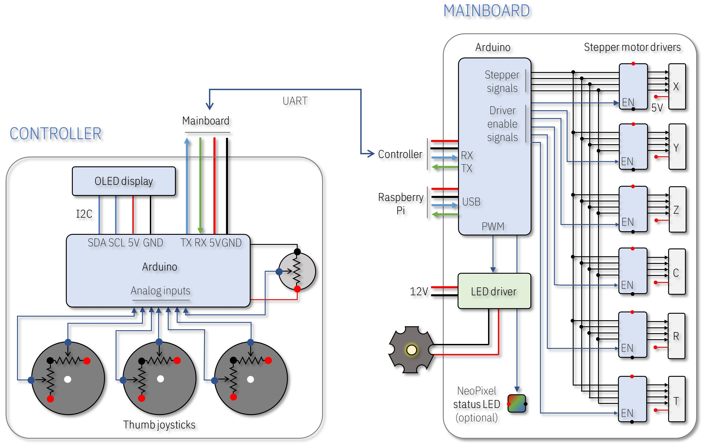

# An open-source MICROSCOPE built using LEGO bricks, Arduino and Raspberry Pi


## Key Features

- **Fully motorized:** Camera angle, sample position, magnification and focus can be adjusted precisely using six stepper motors.
- **Modular:** Stages and modules can be arranged in any configuration depending on the application.
- **Versatile:** Uniform illumination guarantees high quality imaging for a variety of samples with reflective or transparent surfaces.  
- **Wide magnification range:** Samples with features from several centimeters to several micrometers can be imaged without changing the objective lens.
- **Low-cost:** The whole assembly costs from $200 to $400 depending on the features and the vendors of the electronic components.  
- The microscope uses a **Raspberry Pi** mini-computer with an **8MP camera** to capture images and videos. Stepper motors and the illumination are controlled using a circuit board comprising an **Arduino microcontroller**, six **stepper motor drivers** and a **high-power LED driver**. All functions can be controlled from a keyboard connected to the Raspberry Pi or a separate custom-built Arduino joystick connected to the mainboard. **LEGO bricks** are used to construct the main body of the microscope to achieve a modular and easy-to-assemble design concept.


## Assembly instructions

| [Video (YouTube)](https://youtu.be/PBSYnk9T4o4) | [Instructions (PDF)](Instructions.pdf) |
| ----------------------------------------------- | -------------------------------------- |
| [](https://youtu.be/PBSYnk9T4o4) | [](Instructions.pdf) |


## Operation principle

The microscope has a simple operation principle based on changing the magnification and the focus by adjusting the relative distances between a **camera**, a single **objective lens** and a **sample**. Briefly, two linear stages with stepper motors are used to adjust these distances for a continuous and wide magnification range. Four additional stepper motors **tilt** the camera module and change the **X-Y position** and **rotation** of the sample. A **uniform light source** illuminates the sample either from an angle *(reflected light)* or from the bottom of the sample *(transmitted light)*. The system can also be used as a *digital water contact angle goniometer* by taking cross-section images of droplets. 


## Assembly steps

- [Enjoy the YouTube video and get a general idea about the assembly of the microscope.](https://youtu.be/PBSYnk9T4o4) 

- [Follow the detailed instructions provided in the PDF document.](Instructions.pdf)

- [3D print the design files.](#3D-printing)

- [Build the electronic board.](#Electronics)

- [Upload the Arduino code.](#Uploading-the-Arduino-code)

- [Assemble the microscope.](#Final-assembly)

- [Run the Python code.](#Python-Raspberry-Pi)

- [Try different operation modes and enjoy the microscope.](#Basic-operation-modes)

  

## 3D printing

I assembled the main body of the microscope using individually-purchased [LEGO bricks](https://www.lego.com/en-us/page/static/pick-a-brick). Instead of using motors and gears from LEGO Technic, I designed custom actuators using [FreeCAD](https://www.freecadweb.org/) software and printed them using my personal [3D printer](https://www.creality3d.shop/products/creality3d-ender-3-pro-high-precision-3d-printer). This approach not only lowered the cost of the microscope but also gave me some flexibility in the design and implementation of precise linear and rotary actuators. In principle, the whole structure could be 3D-printed without using any LEGO parts but that would be less modular and more time consuming.  

All STL files for 3D printing and the original FreeCAD files for editing are available in this [folder](https://github.com/IBM/MicroscoPy/tree/master/3D-design-files). You may need to install [FreeCAD Gear workbench](https://wiki.freecadweb.org/Macro_FCGear) to edit the gears. 

:warning: A good quality printing depends on many factors. I optimized the designs after several iterations of printing. If the parts do not match well, some minor modification in the original design file (e.g. enlarging the holes matching to LEGO studs) or polishing/drilling may be required. More information on the printer and slicer settings is given in the [PDF document](Instructions.pdf). 


## Electronics  

:warning: **This part requires some basic knowledge on electronic circuit design and Arduino.**

All design and Gerber files of printed circuit board (PCBs) are available in this [folder](/Circuit). I designed the PCBs using [DesignSpark PCB software](https://www.rs-online.com/designspark/pcb-software). The list of all components can be found in the [PDF document](Instructions.pdf) (page #71)  

There is also a separate [instruction manual](/Circuit/CircuitAssembly.pdf) giving more details about the assembly of the circuit boards.

The operation of the electronics is straight-forward. I used two Arduino microcontrollers, one for the *mainboard* (essential) and one for the joystick *controller* (optional), to control the stepper motors and the LED illumination of the microscope. In principle, everything could be controlled directly from the Raspberry Pi without using any Arduino microcontroller but I decided to leave testing this option for another time.

:bulb: The joystick controller is optional because the stepper motors and the LED can also be controlled from a keyboard connected to the Raspberry Pi. But having a joystick is fun!




I preferred [Adafruit ItsyBitsy 32u4 5V](https://learn.adafruit.com/introducting-itsy-bitsy-32u4) but any Arduino board with enough number of I/O pins should work. If you want to use the joystick controller, the Arduino boards should support serial (UART) communication because they cannot communicate with each other via their USB ports. 

The Arduino on the *controller* circuit reads the status of three [thumb joysticks](https://www.sparkfun.com/products/9032) (for six stepper motors) and a potentiometer (for the LED intensity) via its analog inputs. The data is sent to the Arduino on the *mainboard* via UART (RX, TX) serial communication. An OLED display on the *controller* can be used to display useful information, like the PWM (pulse-width modulation) intensity of the LED. The Arduino on the *mainboard* receives and processes the incoming data and sends stepper motor signals to the corresponding stepper motor via its respective [motor driver](https://www.adafruit.com/product/3297). Six motor drivers share the same signal pins but only one driver is activated at a time using the *enable* *(EN)* or the *sleep* *(SLP)* pin of the driver. This implementation requires only 10 I/O pins *(4 signal + 6 enable)* instead of 24 *(4 signal x 6 motors)*. It also prevents the heating of the motors when they are idle and limits the current consumption by allowing only one motor running at a time. Alternatively, a motor driver with a built-in indexer with STEP/DIRECTION control can be used to reduce the number of I/O pins but such drivers are more expensive. The data is sent only if there is a change in the joystick position is detected to avoid continuous communication. 

The *mainboard* can be powered from an external 5V wall charger or directly from the USB port of the Raspberry Pi. The latter also allows USB communication between the *mainboard* and the Raspberry Pi to control the stepper motors and the LED intensity from a keyboard. The intensity of the LED is controlled by PWM using a dedicated pin on the Arduino. I recommend keeping the LED off while the Raspberry Pi is booting and then gradually increasing the intensity. The [LED driver](https://www.digikey.com/products/en?keywords=945-1818-5-ND) and the [high-power LED](https://www.digikey.com/products/en?keywords=1672-1161-ND) used in this project required more than 6V for a rated operation. I initially used an external 12V power adapter for the LED but later generated 12V directly from the USB port of the Raspberry Pi using a step-up [DC-DC converter](https://www.banggood.com/DC-DC-Boost-Buck-Adjustable-Step-Up-Step-Down-Automatic-Converter-XL6009-Module-p-1087346.html?rmmds=search&cur_warehouse=CN). In this case, the 5V power adapter should be able to supply enough current for the Raspberry Pi, stepper motors and the LED. I tested the system using a single 5V / 3A supply (original Raspberry Pi 4 power supply or a wall charger). Different configurations may require different power ratings. For example,  if the display is also powered from the same source, then a more powerful 5V source would be needed. [Here](https://www.digikey.com/products/en?keywords=709-GST60A05-P1J) is a good one.  


## Uploading the Arduino code 

- Download the latest version of the [Arduino IDE](https://www.arduino.cc/en/main/software) 
- Install the libraries (Sketch → Include Library → Manage Libraries):
  - [AccelStepper](http://www.airspayce.com/mikem/arduino/AccelStepper/): used to control the stepper motors (mainboard).
  - (Optional) [Adafruit NeoPixel](https://github.com/adafruit/Adafruit_NeoPixel): if you want to have a status LED or nice color effects in the mainboard.
  - (Optional) [Adafruit_GFX](https://github.com/adafruit/Adafruit-GFX-Library) and [Adafruit_SSD1306](https://github.com/adafruit/Adafruit_SSD1306): if you want to have an OLED display in the joystick to show the intensity of the LED illumination.
- Add the board by following these [instructions](https://learn.adafruit.com/introducting-itsy-bitsy-32u4/arduino-ide-setup). 
- Upload the [code(s)](/Arduino). 


## Final assembly

Follow the detailed instructions given in the [PDF document](Instructions.pdf). Briefly:

- It is important to fix the [32x32 LEGO baseplate](https://www.lego.com/en-us/product/white-baseplate-11010) to a rigid table or support for a good mechanical stability. Rubber dampers or an air cushion can be used to minimize vibrations.  
- Unfortunately it is not possible to create a public shopping basket in the [LEGO shop](https://www.lego.com/en-us/page/static/pick-a-brick), all parts need to be added one by one. I listed the LEGO parts in the document but I recommend buying extra bricks and plates in case you need to change something. 
- Some LEGO parts are needed to be glued permanently for better stability. I provided recommendations in the document based on my experience. In general, it is a good idea to glue a smaller LEGO piece (e.g. 2x2) to a larger one (e.g. 2x4) to have a stronger interlocking while preserving the advantage of LEGO bricks for modularity. 
- After assembling the microscope and connecting all the cables, boot the Raspberry Pi. 
- :warning: Do not forget to enable the camera from the Raspberry Pi configuration (Preferences → Raspberry Pi configuration → Interfaces → Camera Enabled → Reboot)  as explained [here](https://projects.raspberrypi.org/en/projects/getting-started-with-picamera). 


## Python-Raspberry Pi

I wrote a simple [program](/Python) in Python 3 to control the microscope, modify camera settings and take photos and videos from keyboard. The code allows changing almost all camera settings using keyboard shortcuts. The speed and the direction of the stepper motors and the LED intensity can also be controlled from the keyboard independently from the joystick controller.

The code requires following dependencies: 

- [EasyGUI](https://pythonhosted.org/easygui/index.html): to generate simple message boxes and select the folder where the images are saved
- [pySerial](https://pythonhosted.org/pyserial/): to communicate with the Arduino via USB
- [pynput](https://pypi.org/project/pynput/): to monitor keyboard inputs

There are two important parameters in the program to be changed according to your configuration:

**HighResolution:** 

- **True** for (3280x2464), tested with Raspberry Pi 4.
- **False** for (1920x1080), tested with Raspberry Pi 3 and Zero. 

**KeyboardControl:** 

- **True** if the Arduino mainboard is connected to the Raspberry Pi via USB.
- **False** if the mainboard is not connected and powered from an external 5V supply 

**Finally, launch the program from the terminal and enjoy the microscope:** 

```bash
python3 /home/pi/MicroscoPy.py 
```


## Basic operation modes


## License

This project uses the [Apache License Version 2.0](LICENSE) software license. 

Separate third-party libraries used in Arduino and Python codes are licensed by their respective providers pursuant to their own separate licenses. 


## About

**The microscope is not currently available for purchase in kit or built form.** 

My initial goal was to develop a lab tool for our research work on [microfluidics for point-of-care diagnostics](https://www.zurich.ibm.com/st/precision_diagnostics/mobile_health.html). With the support from IBM, we decided to release the instructions open source so that other research labs, schools, students, kids and hobbyist can benefit from this low-cost and performant microscope. 

The concept design, hardware/software implementation, illustrations, animations, stop motion video, basically everything is done by myself as a hobby project without any technical or financial support from a third-party.  

I am not a software developer, the codes I wrote are probably not very efficient and my writing style may look unusual to an experienced developer. But I hope they are easy to understand and serve as a good starting point for further development.

There are probably many things that could be done better. I hope this prototype inspires other DIY enthusiasts and makers to build better microscopes. 

Copyright 2020 [Yuksel Temiz](https://researcher.watson.ibm.com/researcher/view.php?person=zurich-YTE)

